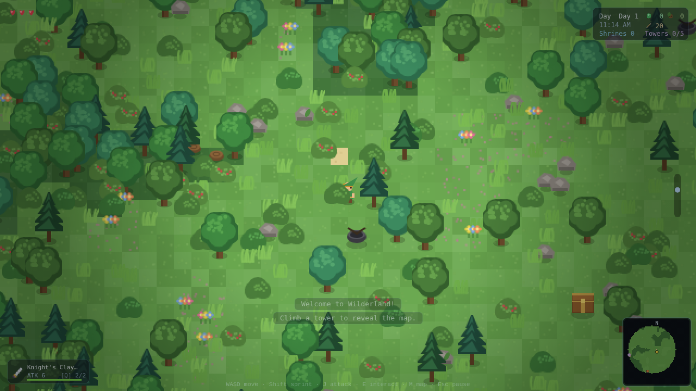
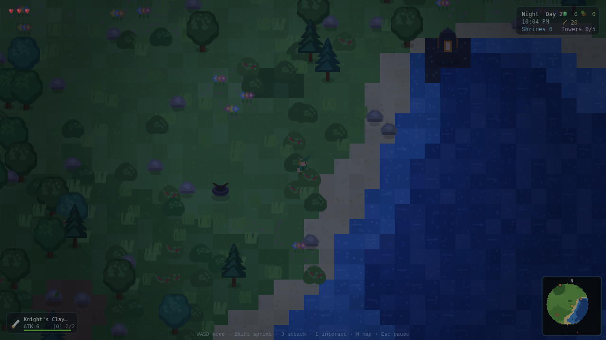

# 🗡️ Wilderland — *Breath of the Top-Down*

A **Legend of Zelda: Breath of the Wild**–inspired top-down action-adventure that runs entirely in your browser. No engine, no build step, **no dependencies** — all art and audio are generated procedurally at runtime, so the whole game is a few hundred KB of hand-written JavaScript.

Explore a procedurally generated open world, climb Sheikah towers to reveal the map, scale cliffs and swim rivers (minding your stamina), fight Bokoblin camps, activate shrines for heart containers, hunt hidden Koroks, cook meals, and survive the Blood Moon.



*Day breaks over the woods…*



*…and nightfall brings a cold coast and a distant Sheikah tower.*

## Play it

Because the game is self-contained, there are three ways to run it:

**1. One-file build (easiest — just double-click)**
```bash
npm run build          # writes dist/wilderland.html
```
Open `dist/wilderland.html` in any modern browser. That single file *is* the whole game.

**2. Local dev server (recommended for development)**
```bash
npm start              # serves at http://localhost:8080
```
Then open http://localhost:8080. Any static server works too (`npx serve`, `python3 -m http.server`, …).

**3. Directly**
`index.html` uses classic (non-module) scripts, so on most browsers you can open it straight from disk (`file://…/index.html`).

### Deploying (Vercel / Netlify / GitHub Pages)

`vercel.json` runs `npm run build`, which inlines everything into a single
self-contained `public/index.html` (no separate CSS/JS files to mis-serve), and
Vercel serves `public/`. On Vercel the project just needs to redeploy after a
push — no extra settings. For any other static host, publish the `public/`
directory (or drop the single `dist/wilderland.html` anywhere).

## Controls

| Action | Keys |
| --- | --- |
| Move | `W A S D` / Arrow keys |
| Sprint (uses stamina) | Hold `Shift` |
| Climb a cliff (uses stamina) | Walk into it |
| Swim (uses stamina) | Walk into deep water |
| Attack / slash | `J` or **Left-click** |
| Shoot bow (aim with mouse) | `K` or **Right-click** |
| Throw a bomb (rune) | `B` |
| Interact / open / activate / land | `E` or `Space` |
| Cycle weapon | `Q` |
| Eat food (heal) | `F` |
| Map | `M` · Inventory `Tab` · Pause `Esc`/`P` |
| Mute sound / music | `0` / `9` |

## Systems (the BotW flavor)

- **Stamina wheel** gating sprinting, climbing and swimming — run out mid-climb and you fall.
- **Cliff climbing & swimming** as stamina-gated traversal of otherwise-blocking terrain.
- **Sheikah towers** — activate to reveal the region on the map, then **paraglide** off the top.
- **Shrines** — activate for alternating **Heart Containers** / **stamina** upgrades; they double as respawn points and full heals.
- **Weapons with durability** (swords, spears, claymores) that break and drop from chests & enemies.
- **Bow & arrows** and a **Bomb rune** (breaks boulders, damages groups).
- **Enemy camps** (Bokoblins, Blue Bokoblins, Octoroks) around campfires, guarding a chest — clear them for loot.
- **Wandering enemies** (Chuchus, Keese, Octoroks) that grow tougher and more numerous at night.
- **Day/night cycle** with dawn/dusk color grading and a **Blood Moon** every third night that revives fallen foes.
- **Temperature** — snowy peaks freeze you unless you're near a fire or ate a warm cooked meal.
- **Cooking** — combine ingredients at a cooking pot into hearty (and warming) meals.
- **Hidden Koroks**, grass you can cut for loot, breakable boulders, and a minimap that fills in as you explore.
- **Autosave** to `localStorage` (progress, map reveal, activated structures).

## Project layout

```
index.html            # loads the scripts in dependency order
styles.css
server.js             # zero-dep static server (npm start)
scripts/
  build.js            # inlines everything -> dist/wilderland.html
  smoketest.js        # Playwright: boot + input + no-error check
  featuretest.js      # Playwright: exercises every system
js/
  core/    util rng input audio sprites      # math, RNG/noise, input, WebAudio SFX, procedural sprites
  world/   tiles worldgen world              # tile defs, biome generation, collision + chunked rendering
  entities/weapons particle projectile
           player enemy pickup               # Link, foes, drops, arrows/bombs, FX
  systems/ daynight spawner                  # clock + blood moon, population control
  ui/      hud minimap menus                 # HUD, map, title/pause/inventory
  game.js  main.js                           # orchestrator + game loop
```

The code is deliberately dependency-free and framework-free: a study in how much game you can fit into plain Canvas 2D. Rendering is chunk-cached tiles + a y-sorted sprite pass under an integer-zoom pixel camera; the world is layered value-noise biomes on an island falloff.

## Tests

```bash
npm test               # headless boot + movement + zero-console-error check
npm run test:features  # headless run through towers, shrines, chests, koroks,
                       # cooking, swim, climb, combat, day/night, bow
```
(Requires Playwright + Chromium available on the machine.)

## License

MIT. A fan-made homage; *The Legend of Zelda* and *Breath of the Wild* are trademarks of Nintendo, which is not affiliated with this project.
